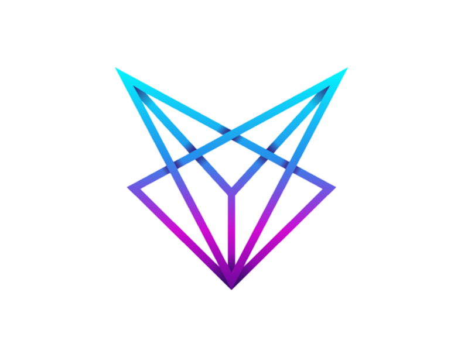

###### The Lithe Project&trade; Development Team

> This repository holds documents, images and snippets regarding The Lithe Project.

#### Repo Directions

**Images**

- [The Lithe Project&trade; Logo](https://github.com/LithyRiolu/Resources/blob/master/Images/logo.png)

**Snippets**
- [Flowconfig](https://github.com/LithyRiolu/Resources/blob/master/Snippets/flow.flowconfig)

#### Other Lithe Projects

- **[DecentraChat](github.com/lithyriolu/decentrachat)** - Decentralised, P2P chatting application built using Go. In theory, each port is a chatroom.
- [QML-FlatUI](github.com/lithyriolu/qml-flatui) - A component framework for creating elegant applications using QML.

#### Donate

| Donate | Address |
|--------|---------|
| AmityCoin (XAM) | `amitYjRzkZMNcAGji6BoRDiDax71h2pJrfyQizXnttUHKxNxqGJDZWtESaabbSjRQD5WhyDey4qn9XZpFcAgxxTg5mtJTF9jTM` |
| ArQma (ArQ) | `ar2mqMg2SUYVUeV9vzSQuyRurKUKrfVbzWMd5AArDAEy381zMxqHAnq7e6DGLjMQwS1zoU2utuW83SFYJmYTS4sY2Ams1V6nv` |
| Doge (DOGE) | `DK2TjjQDxjsQkFDGtAe5VDMM4ZN5wnDB6V` |
| Lethean (LTHN) | `NaWe5B5NqvZ3TV2Mj1pxYtTgrnTBwQDMDNtqVzMR6Xa5ejxu6hbi6KULHTqd732ebc5qTHvKXonokghUBd3pjLa8czovfrW1G561vPanSPRh` |
| Monero (XMR) | `8BycUyGk8GuDYNnAbAHhoxQBLecUJQbExbSX21Z9DoaB5jcEVtNAY7d4puNnB6psJ5SptRw42r4v6fp1yFHTUWaW9RaQDvb` |
| NibbleClassic (NBX) | `Nib1fzFuBrQeumAJCf5ntj2K6jWQJnzZTU2Bz8ejSu1T8QzowcQWoe5a9LCLPqnfcqfSMXTdKWULfgwZxBioX4yi5p4UDjF29x`
| TurtleCoin (TRTL) | `TRTLuzcHQu2Z3QotVB4C7yihoN4Kw2fhzMwF2DWVVK2AhGWaBZhsUJhWsG7z6BYYoqgyiQVHHJeRiU78UmwLcfqPTY1MBS7bjzb` |
